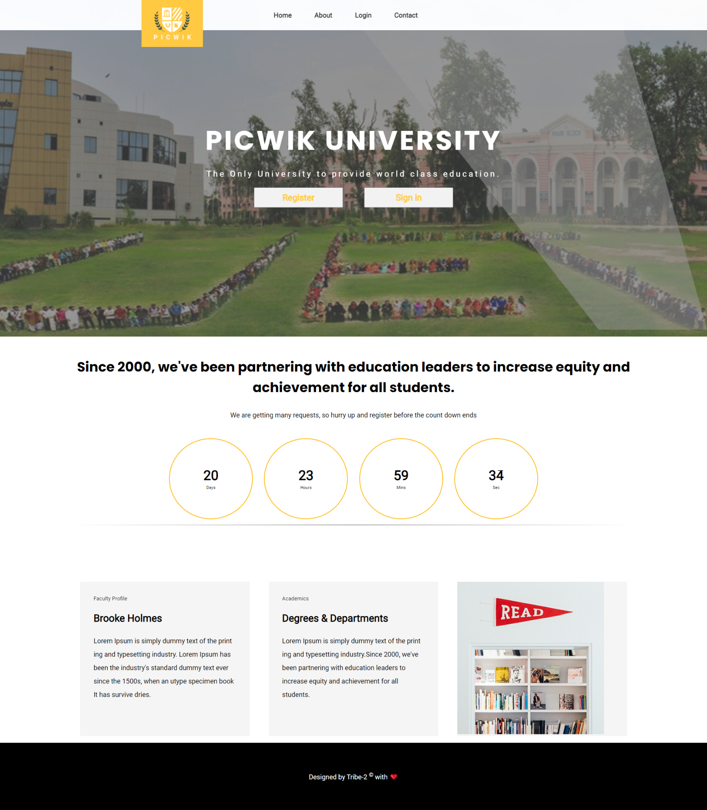
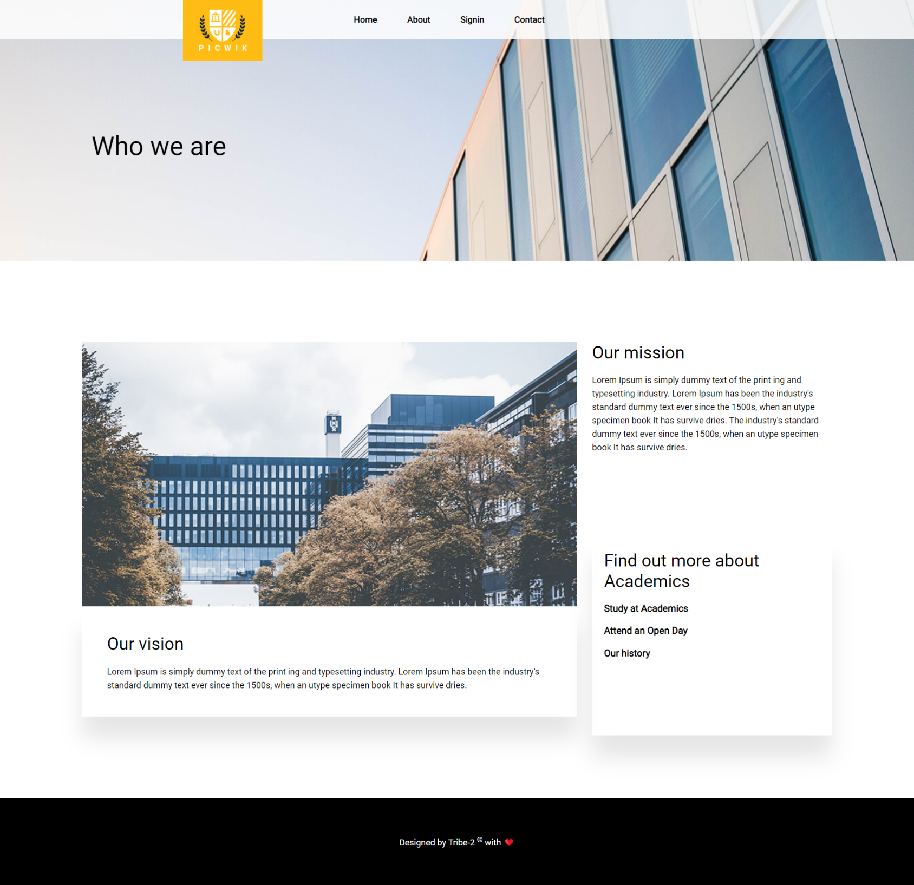
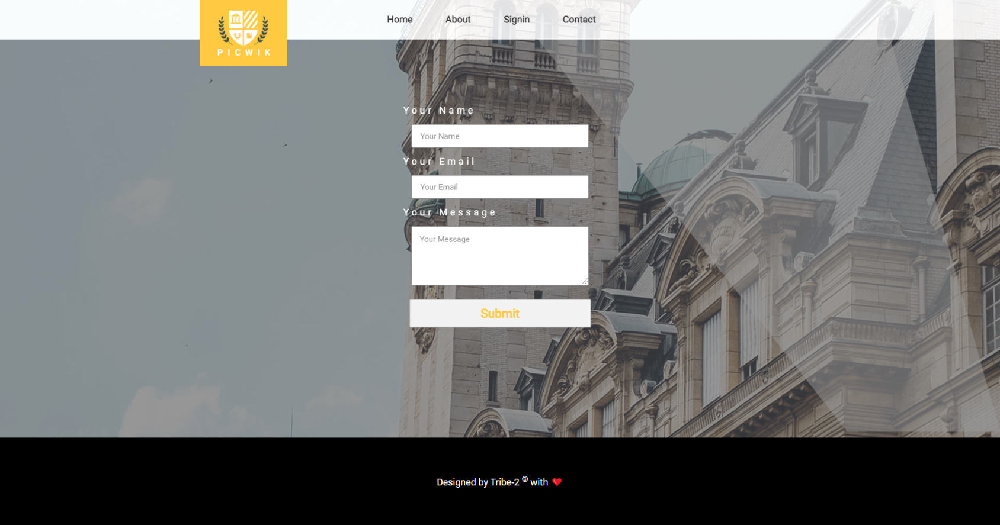
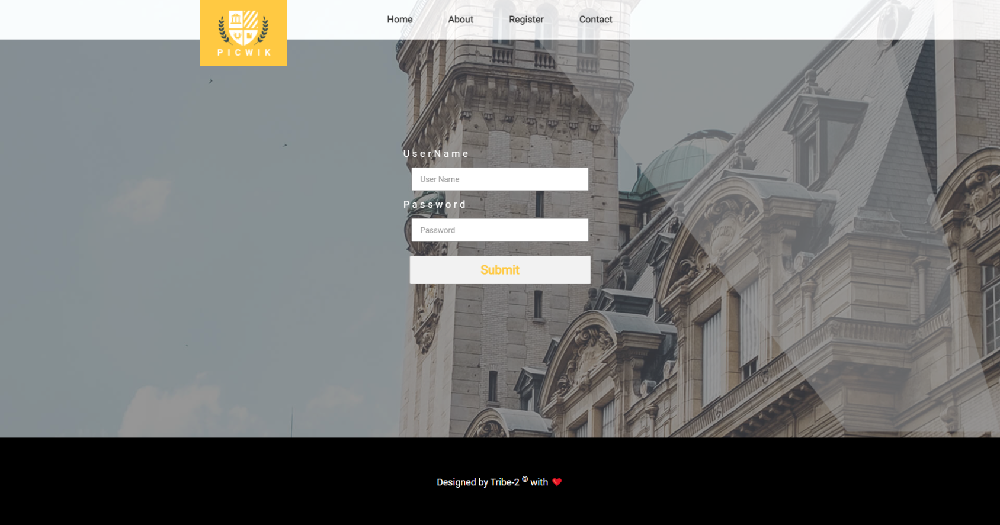
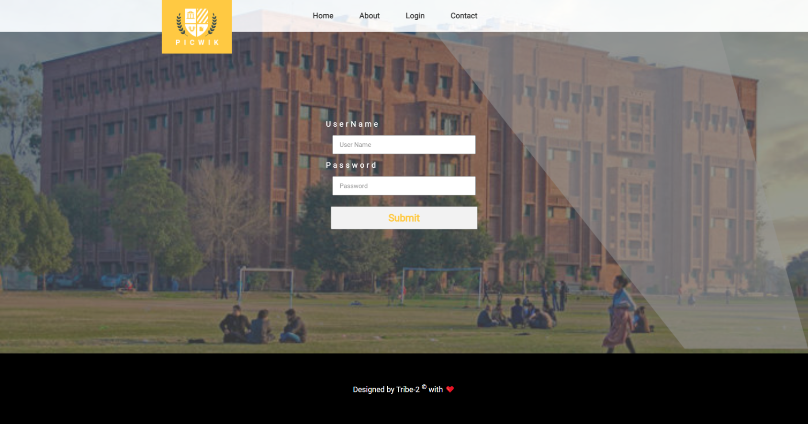
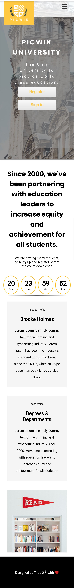
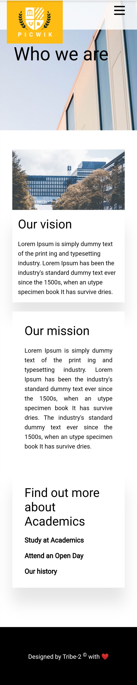
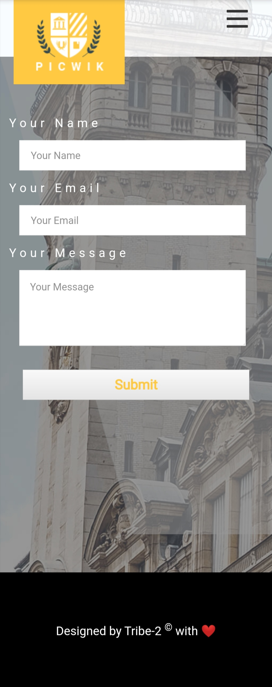
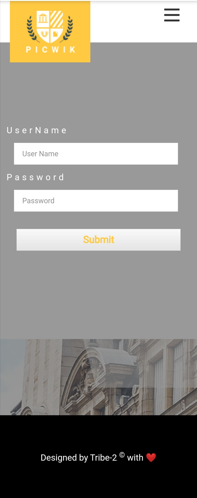

# <center>PICWIK UNIVERSITY</center>

###### <center>This Project is Created By Tribe 2 of Jadu Full Stack Development FellowShip </center>

<hr>

## Table of Content

1. [Project Description](#Project-Description)
2. [Project Contributors](#Project-Contributors)
3. [Project Pictures](#Project-Pictures)

### Project Description

This Project is created as an assignment of Jadu Full-Stack development fellowship. This was a group project and Jadu-Tribe-2 (we) created this in a group.

In this project we tried to create is according to the description written below:

```
You're free to build anything, come up with your own design and creativity.
Make sure you fulfill the following instructions:

- A Timer or Clock Section
- Sign up and Login Page (save the data to local storage)
- Contact Page
- The website must have at least 3 different pages
- Must be responsive
- Must follow Github best practices (Pull Requests and code review)
- Have a proper README.md file
- Signup will save the record to local storage.
- The login will verify the record in localStorage record and show a message (in both cases)

This is a group project, collaborate with your tribe members to complete the project.
This project will be properly reviewed. Your GitHub collaboration, README,
the way you write code everything matters,
so make sure you pay attention to everything.
Theme Forest is a good place to look up some design ideas.

Note: The Timer/Clock and Contact page images are just an example.
Deadline: 31 March, 2021
```

### Project Contributors

This Project is created by

1. [Sameer Katija](https://www.github.com/Anonster)
   - [Twitter](https://twitter.com/sameerkatija)
   - [LinkedIn](https://www.linkedin.com/in/sameerkatija/)
   - [Dev.to](https://www.linkedin.com/in/sameerkatija/)
   - [Medium](https://www.linkedin.com/in/sameerkatija/)

<br>

2. [Shahid Yousafxai](https://github.com/ShahidYousafxai)
   - [LinkedIn](https://www.linkedin.com/in/ShahidYousafxai/)
   - [Medium](https://shahidyousafxai.medium.com/)
<br>

3. [Muhammad Zain Khan](https://github.com/zainkhandev)
	- [LinkedIn](https://www.linkedin.com/in/zainkhandev/)


### Project Pictures

#### <center>Desktop View</center>

##### 1. Home Page



##### 2. About page



##### 3. Contact Page



##### 4. Sign In Page



##### 5. Register



<hr>

#### <center>Mobile View</center>

##### 1. Home Page



##### 2. About page



##### 3. Contact Page



##### 4. Sign In Page



##### 5. Register


